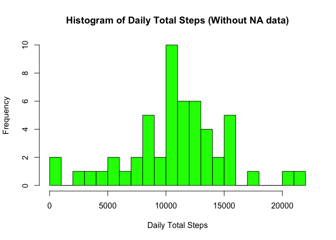
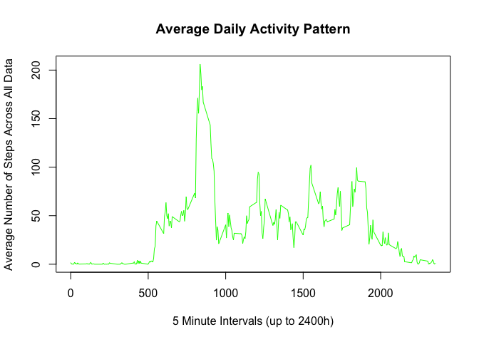
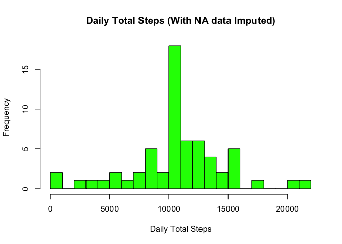
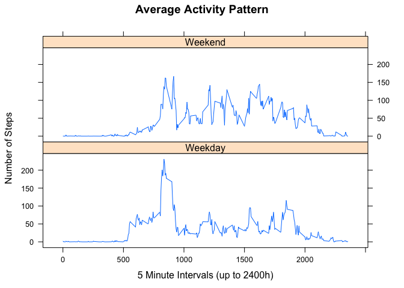

# Reproducible Research: Peer Assessment 1
####By Travis Hill
####02/17/2016

##Data Summary
This assignment makes use of data from a personal activity monitoring device. This device collects data at 5 minute intervals through out the day. The data consists of two months of data from an anonymous individual collected during the months of October and November, 2012 and include the number of steps taken in 5 minute intervals each day.

## Loading and preprocessing the data
We begin by loading the dataset into `activitydata`:


```r
activitydata = read.csv('activity.csv', head = TRUE, colClasses = c("integer", "character", "integer"), na.strings = "NA")
```

Our date column is currently of type `character`. Next, we will convert the date data into the proper date type:


```r
activitydata$date <- as.Date(activitydata$date)
```

Next we will create a new dataframe by subsetting the original, pulling entries that do not contain NA values:

```r
activitydatasub <- subset(activitydata, !is.na(activitydata$steps))
```

## What is mean total number of steps taken per day?
Now that we have loaded in and preprocessed our data, we will use `tapply` to get the total number of steps per day:

```r
daysum <- tapply(activitydatasub$steps, activitydatasub$date, sum, na.rm = TRUE, simplify = TRUE)
```

Next, we generate the histogram of daily sum totals, over all dates:

```r
hist(
    x = daysum, 
    col = "green", 
    breaks = 30, 
    xlab = "Daily Total Steps", 
    ylab = "Frequency", 
    main = "Histogram of Daily Total Steps (Without NA data)")
```

 

And finally, we will determine mean and median daily total steps per day:

```r
mean(daysum)
```

```
## [1] 10766.19
```

```r
median(daysum)
```

```
## [1] 10765
```
## What is the average daily activity pattern?
To graph the average daily activity pattern, we first need to determine the average number of steps for each time interval, and then create a data frame matching those averages to the appropriate interval.


```r
intervalavg <- tapply(activitydatasub$steps, activitydatasub$interval, mean, na.rm = TRUE, SIMPLIFY = TRUE)
ad_int_avg <- data.frame(interval=as.integer(names(intervalavg)), avg=intervalavg)
```

We now have a single data frame, with columns for `interval` and for `avg`:


```r
head(ad_int_avg)
```

```
##    interval       avg
## 0         0 1.7169811
## 5         5 0.3396226
## 10       10 0.1320755
## 15       15 0.1509434
## 20       20 0.0754717
## 25       25 2.0943396
```

We can now plot the time interval against the average number of steps taken during that interval, to yeild the Average Daily Activity Pattern:


```r
plot(ad_int_avg$interval, ad_int_avg$avg, 
     type = "l", 
     col = "green", 
     xlab = "5 Minute Intervals (up to 2400h)", 
     ylab = "Average Number of Steps Across All Data", 
     main = "Average Daily Activity Pattern")
```

 

Finally, we determine the 5 minute interval on which the maximum number of steps is achieved:


```r
ad_int_avg[ad_int_avg$avg == max(ad_int_avg$avg), ]
```

```
##     interval      avg
## 835      835 206.1698
```

We can now say that a maximum of `206.1698` steps is achieved in interval `835`.

## Imputing missing values

Next, we will refer back to our original dataframe (`activitydata`), and simply sum the entries with missing data:


```r
sum(is.na(activitydata$steps))
```

```
## [1] 2304
```

We have `2304` rows in our original data set without data.

We will create a new dataframe, `ad_imp`, which will be a copy of `activitydata`, and which we will use to impute the missing data. We will use the strategy of filling in any missing data with the average number of steps for that particular 5 minute interval.


```r
ad_imp <- activitydata
isNA <- is.na(ad_imp$steps)
ad_imp$steps[isNA] <- intervalavg[as.character(ad_imp$interval[isNA])]
daysum_imp <- tapply(ad_imp$steps, ad_imp$date, sum, na.rm = TRUE, simplify = TRUE)
```

Let's quickly check to make sure we are no longer missing any data in `ad_imp`:


```r
sum(is.na(ad_imp$steps))
```

```
## [1] 0
```

It looks like we're ready to create an updated histogram of daily total steps, with the new imputed dataframe. We'll also calculate the `mean` and `median` for these totals as well:


```r
hist(x = daysum_imp,
     col = "green",
     breaks = 30,
     xlab = "Daily Total Steps",
     ylab = "Frequency",
     main = "Daily Total Steps (With NA data Imputed)"
     )
```

 

```r
mean(daysum_imp)
```

```
## [1] 10766.19
```

```r
median(daysum_imp)
```

```
## [1] 10766.19
```

####Results
Looking at the new histogram, mean and medium for the imputed data shows that the new mean is now equal to 10766.19, which is the same as the median, while the median shows no change. The strategy we implemented to impute the data, inserting average totals per interval with missing data, likely explains why the mean and median are now the same. 

## Are there differences in activity patterns between weekdays and weekends?

To begin, we need to determine whether a particular date is a weekday or a weekend, and add this information to our dataframe:


```r
determineWeekday <- function(day) {
    weekday <- weekdays(day)
    ifelse(weekday == "Saturday" | weekday == "Sunday", "Weekend", "Weekday")
}

## Create new vector to add to ad_imp to determine whether a given date is a weekend or weekday

weekCol <- sapply(ad_imp$date, determineWeekday)
ad_imp$day <- as.factor(weekCol)
```

Now our dataframe has an additional column, specifying whether a given `date` is a `Weekday` or `Weekend`:


```r
head(ad_imp)
```

```
##       steps       date interval     day
## 1 1.7169811 2012-10-01        0 Weekday
## 2 0.3396226 2012-10-01        5 Weekday
## 3 0.1320755 2012-10-01       10 Weekday
## 4 0.1509434 2012-10-01       15 Weekday
## 5 0.0754717 2012-10-01       20 Weekday
## 6 2.0943396 2012-10-01       25 Weekday
```

Finally, we will create a 2-plot panel for the Average Activity Pattern, using `day` as a factor:


```r
library(lattice)

dayData <- aggregate(steps ~ day+interval, data = ad_imp, FUN = mean)

xyplot(steps ~ interval | factor(day),
       data = dayData,
       layout = c(1, 2),
       type = "l",
       lty = 1,
       xlab = "5 Minute Intervals (up to 2400h)",
       ylab = "Number of Steps",
       main = "Average Activity Pattern")
```

 

####Results
The resulting plots show that activity on weekdays generally begins earlier, and ends earlier (beginning around 500, and slowing around 1900), while weekend activity begins later, ends slightly later, and is sustained at a higher average rate over the course of the day.

